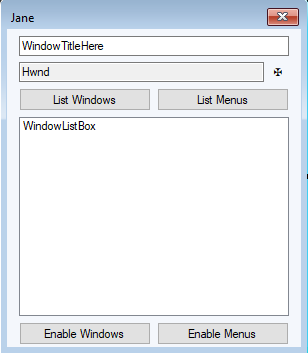
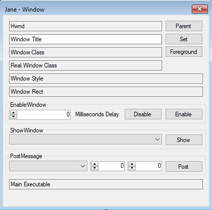

# Jane (Just ANother Enabler)
Just another tool to interact with the [Windows User Objects](https://docs.microsoft.com/en-us/windows/win32/sysinfo/user-objects) of another application. 
* Window manipulation (e.g. enabling buttons / changing a window title) 
* Menu manipulation (e.g. enabling menus / highlighting menu items)

## Usage
1. [Get the latest build of Jane from the releases](https://github.com/CompassSecurity/Just-ANother-Enabler/releases/)
2. Run the single executable
3. Enter the title of another window / Select a window by dragging the maltese cross over
5. Click `Enable Windows` / `Enable Menus` (this will execute after a 1.5 second delay)
6. Switch focus back to the manipulated application in order to prevent it from re-rendering
7. Wait until the menus / buttons are enabled.

For advanced use cases, list the menus / windows and select them. A new window will open.

## Why Jane
* Single executable
* Open source
* Delayed execution of actions

There are several other applications with somewhat similar capabilities (`Enabler`, `Enable!`, `Windows Enabler`, `Daanav Enabler`, `Spy++`, ... you name it). 
During one of our penetration tests, we encountered an application where these tools proved ineffective: The application under test was re-rendering GUI elements as soon as the focus was received and all previously performed manipulations were invalidated. Neither did defined shortcuts work in the scenario. Therefore, the need for Just ANother Enabler with a delay functionality was born.

## Compile Instructions
Jane is written using C# 8.0 features. To easily compile this project, use Visual Studio 2019.

## Notes
This is a test tool.
* Only basic error handling is implemented
* There will probably be some bugs
